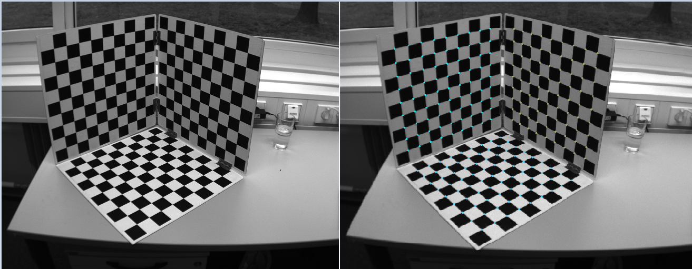

## cornerDetect and Multi-checkerboard automatic detection 
- realize the paper "Automatic Camera and Range Sensor Calibration using a single Shot"

 

## Dependencies
The following dependencies are needed.  
The version numbers are the ones used during development.  
- OpenCV 3.1.0 other opencv version is also promise.

The code was developed on a Windows machine with Visual Studio 2013. 
 
## Contacts
- The chess recovery class source code can contact: 997737609@qq.com.
- Any questions about this project can also contact: 997737609@qq.com.
- The main purpose is find the bugs of the code.

## References
## [1]"Automatic Camera and Range Sensor Calibration using a single Shot" 2012

## [2] https://github.com/qibao77/cornerDetect

## The camera calibration problem can contact me if the visual range and lighting conditions are uncertain or the number of checkerboard lattice is uncertain.
